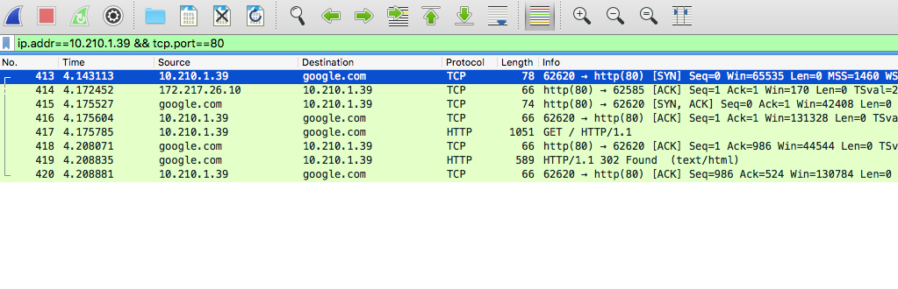
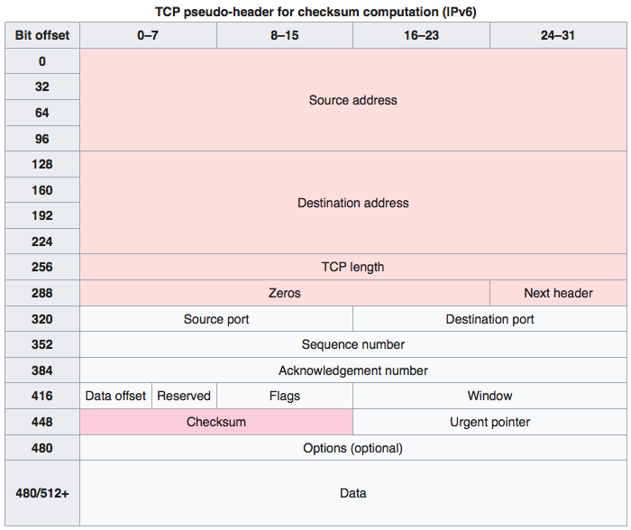

# Quest 09. What is server

## Introduction
* 이번 퀘스트에서는 인터넷이 어떻게 동작하며, 서버와 클라이언트, 웹 브라우저 등의 역할은 무엇인지 알아보겠습니다.

## Topics
* 서버와 클라이언트, 그리고 웹 브라우저
* 인터넷을 구성하는 여러 가지 프로토콜
  * IP
  * TCP
  * HTTP
* DNS

## Resources
* [OSI 모형](https://ko.wikipedia.org/wiki/OSI_%EB%AA%A8%ED%98%95)
* [IP](https://ko.wikipedia.org/wiki/%EC%9D%B8%ED%84%B0%EB%84%B7_%ED%94%84%EB%A1%9C%ED%86%A0%EC%BD%9C)
  * [Online service Traceroute](http://ping.eu/traceroute/)
* [TCP](https://ko.wikipedia.org/wiki/%EC%A0%84%EC%86%A1_%EC%A0%9C%EC%96%B4_%ED%94%84%EB%A1%9C%ED%86%A0%EC%BD%9C)
  * [Wireshark](https://www.wireshark.org/download.html)
* [HTTP](https://ko.wikipedia.org/wiki/HTTP)
  * Chrome developer tool, Network tab
* [DNS](https://ko.wikipedia.org/wiki/%EB%8F%84%EB%A9%94%EC%9D%B8_%EB%84%A4%EC%9E%84_%EC%8B%9C%EC%8A%A4%ED%85%9C)
  * [Web-based Dig](http://networking.ringofsaturn.com/Tools/dig.php)

## Checklist
* 인터넷은 어떻게 동작하나요? OSI 7 Layer에 입각하여 설명해 보세요.
  * The **Open Systems Interconnection** model (OSI) standardizes communication function of telecommunication or computing systems regardless of their internal structure. In terms of internet, the layers work together as follows:
    1. Physical: is the electrical specifications of the data connection. (ex: electrical cable, fiber cable, pin and voltage specs). Bit rate for any transmitting signals is also controlled at this layer.
    2. Data link: this layer provides the link between two directly connected nodes. It detecs errors in the Layer 1 and defines a protocol to communicate between connected devices. (ex: Ethernet, 802.11 Wi-Fi, PPP).
    3. Network: Once data has travelled from a device to a connected "hub" it needs to be packaged and addressed so it can be sent to *different networks* (ex: DNS address translation, routing data, splitting packets)
    4. Transport: Ensure safe passage of packets, in correct sequence, without duplication and in order. Solve problems during transmission and reception of packets. (ex: QoS, assemble messages)
    5. Session: Oversee communication, tasks related to security, synchronization between sender and receiver. 
    6. Presentation: Format data for exchange between nodes (ex: redirctor software, encryption, data translation, protocol conversion)
    7. Application: User application to network interface (ex: browser, email, file requests)

* 우리가 브라우저의 주소 창에 www.knowre.com 을 쳤을 때, 어떤 과정을 통해 노리의 서버 주소를 알게 되나요?
  * Browser will send info following layers 7->1 and receiving server will follow 1->7 layers (roughly). 
  * OSI is just a model so actual protocols like TCP/IP will be used for communication.
    1. Browser needs to package data about request to ISP's DNS server to retrieve a static address.
    2. TCP solves the transport layer by using the protocol adhered to by the browsers

## Quest
* tracert(Windows가 아닌 경우 traceroute) 명령을 통해 www.google.com까지 가는 경로를 찾아 보세요.
  * 어떤 IP주소들이 있나요?
  * 그 IP주소들은 어디에 위치해 있나요?

        traceroute to google.com (172.217.25.238), 64 hops max, 52 byte packets
        1  10.210.1.1 (10.210.1.1)  1.104 ms  1.314 ms  1.480 ms // local
        2  10.96.6.1 (10.96.6.1)  1.207 ms  1.540 ms  0.993 ms // local
        3  220.85.58.254 (220.85.58.254)  1.684 ms  1.427 ms  1.299 ms //hop to router
        4  * * *
        5  * * * // start of hops around telecom network (KT)
        6  112.189.28.245 (112.189.28.245)  2.346 ms    
            112.189.28.241 (112.189.28.241)  1.541 ms
            112.189.28.245 (112.189.28.245)  1.564 ms
        7  * * * 
        8  112.174.7.154 (112.174.7.154)  9.392 ms
            112.174.7.142 (112.174.7.142)  2.142 ms
            112.174.7.146 (112.174.7.146)  1.949 ms
        9  72.14.194.194 (72.14.194.194)  32.842 ms   // hit google servers in California
            72.14.194.106 (72.14.194.106)  37.083 ms  
            72.14.194.194 (72.14.194.194)  32.917 ms
        10  * 108.170.242.97 (108.170.242.97)  32.895 ms 
        11  108.170.233.19 (108.170.233.19)  32.567 ms
            108.170.233.21 (108.170.233.21)  32.393 ms  33.405 ms
        12  nrt12s14-in-f238.1e100.net (172.217.25.238)  36.684 ms  32.718 ms  33.493 ms 
            // google finally sent me to one of their viable IP addresses
          
* Wireshark를 통해 www.google.com으로 요청을 날렸을 떄 어떤 TCP 패킷이 오가는지 확인해 보세요
  * TCP 패킷을 주고받는 과정은 어떻게 되나요?

    
    * **Connection Establishment**
      * **Frame 413** (SYN): client requests active open, sends sequence number *S*
      * **Frame 414~415** (SYN-ACK): In response server sends acknowledgement number *S+1* and also own number *A*
      * **Frame 416** (ACK): finally clients sends back ACK of *S+1* and sets *A+1*; thus the 3-way handshake is complete.
    * **Communication**
      * **Frame 417**: GET request from `client` to `google.com`
      * **Frame 418**: `google.com` sends acknowledge of request
      * **Frame 419**: `google.com` sends HTTP 302 Found and corresponding data (text/html)
      * **Frame 420**: `client` sends received acknowledge.

  * 각각의 패킷에 어떤 정보들이 담겨 있나요?
     1. Frame: Info about bytes, arrival time, frame length, protocols...
     2. Ethernet: Source Destination info (MAC address), Type info (IPv4) 
     3. TCP packet / HTTP Data (where applicable)
        
        
          
           *[source](https://en.wikipedia.org/wiki/Transmission_Control_Protocol)*
    
     
* telnet 명령을 통해 http://www.google.com/ URL에 HTTP 요청을 날려 보세요. ([In case you are using High Sierra smh...](https://dor.ky/restore-telnet-in-mac-os-high-sierra-10-13/))
  
  * 어떤 헤더들이 있나요?

        sunny$ telnet www.google.com 80
        Trying 74.125.203.99...
        Connected to www.google.com.
        Escape character is '^]'.
        GET / HTTP/1.1
        Host: www.google.com

        HTTP/1.1 302 Found
        Cache-Control: private
        Content-Type: text/html; charset=UTF-8
        Referrer-Policy: no-referrer
        Location: http://www.google.co.kr/?gfe_rd=cr&dcr=0&ei=S6UfWtO-Dc-Q9QWLvpUY
        Content-Length: 269
        Date: Thu, 30 Nov 2017 06:29:31 GMT

        <HTML><HEAD><meta http-equiv="content-type" content="text/html;charset=utf-8">
        <TITLE>302 Moved</TITLE></HEAD><BODY>
        <H1>302 Moved</H1>
        The document has moved
        <A HREF="http://www.google.co.kr/?gfe_rd=cr&amp;dcr=0&amp;ei=S6UfWtO-Dc-Q9QWLvpUY">here</A>.
        </BODY></HTML>

  * 그 헤더들은 어떤 역할을 하나요?
    * `302`: Status response code "Found" indicates how response is going
    * `Cache-Control`: "private" directive indicates cache is dedicated to single user 
    * `Content-Type`: [Entity header](https://developer.mozilla.org/en-US/docs/Glossary/Entity_header) describing media type of the resource
    * `Location`: Response header indicates URL to redirect page to (only used with 3xx status response)
    * `Content-Length`: Entity header describing content of the body

