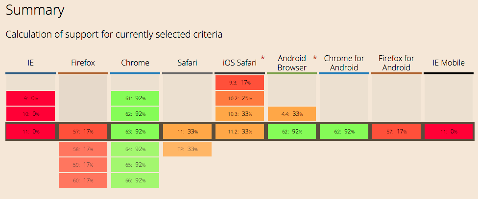
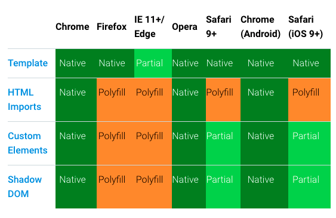

# Quest 16. Polymer

## Introduction
* 이번 퀘스트에서는 Polymer / Vue.js 프레임워크를 통해 현대적인 웹 클라이언트를 개발하는 법을 알아보겠습니다.

## Topics
* Web Component
* Polymer framework
* Shadow DOM
  * Shady DOM
* Virtual DOM
* Vue.js Framework

## Resources
* [Polymer](https://www.polymer-project.org/1.0/)
* [Vue.js](https://vuejs.org/)

## Checklist
### Polymer
* Polymer는 어떤 특징을 가지고 있는 웹 프레임워크인가요?
  * Polymer is an open-source project led by developers from Google's Chrome project.
  * It allows you to build encapsulated, custom elements that work just like standard HTML. 
  * It is sugar built on top of new web standards like [Web Componenets](https://www.webcomponents.org/), making it easier to use them across browsers.
* Shadow DOM이 무엇인가요?
  * As one of the most important aspects of Web Components, they encapsulates and hides the insides of a custom element nested inside a document. A "shadow" DOM tree 
* Web components가 무엇이고, 이 것을 사용할 때 어떤 점을 유의해야 하나요?
  * Web Components are a suite of technologies that allow you to create reusable, custom encapsulated HTML tags to use in web  pages and web apps. They are built using 4 main specifications (not all of them are always used):
    1. [Custom Elements](https://w3c.github.io/webcomponents/spec/custom/): A way to design new types of DOM elements.
    2. [Shadow Dom](https://w3c.github.io/webcomponents/spec/shadow/): Allows encapsulation of style and markup.
    3. [HTML imports](https://w3c.github.io/webcomponents/spec/imports/): Allows inclusion and reuse of HTML documents inside other documents.
    4. [HTML Template](https://html.spec.whatwg.org/multipage/scripting.html#the-template-element/): Defines how to declare template markup for use later on than runtime.
  * Because they use (new) web standards and APIs, portability and interoperability is built in (in theory).
  * Many browsers still lack native supoprt for Web Components. Polyfills are needed, but some features are difficult to polyfill and performance is often impacted (ex: Shadow DOM polyfill).
    * Shady DOM tries to mitigate performance costs by providing a custom shady DOM API that allows tree scoping ( developers can interact with shadow DOM nodes while it is hidden to browsers ).

  * The current state of Web Components in major browsers is as follows (December 2017):

    

  * With the help of Polymer's polyfills:

     

### Vue.js
* Vue.js
  * Like React and other frontend frameworks, Vue.js utilizes a `virtual DOM` to mimick Web Components features so developers can create composable UI elements.
  * Built using javascript instead of web standards, so it has more browser support and avoids the need for polyfills.
  
* Virtual Dom
  * Tries to solve the performance costs of interacting with the DOM by creating a virtual representation where it manages DOM changes and groups together many small changes into one update.
  * Unlike the Shadow DOM that deals with encapsulation, the Virtual DOM is mainly concerned with reducing performance costs and is not a part of the proposed web standards.

## Quest
* ~~Polymer~~Vue를 통해 Quest 07에서 만들었던 바탕화면 시스템을 다시 한 번 만들어 보세요.
  * 어떤 Custom Element가 필요한지 생각해 보세요.
  * 각 클래스별로 해당하는 CSS와 자바스크립트를 어떤 식으로 붙여야 할까요?
  * Custom Element간에 데이터를 주고받으려면 어떤 식으로 하는 것이 좋을까요?
* **이제는 개발이 익숙해졌기 때문에 Skeleton code를 제공하지 않습니다!**
  * 이제부터의 퀘스트는 디렉토리 내에 `submit` 폴더를 만들어 제출해 주시면 됩니다.
  * 서버쪽 코드가 필요할 경우 적절한 `package.json` 파일을 포함하여 제출해 주세요!
